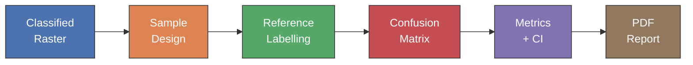
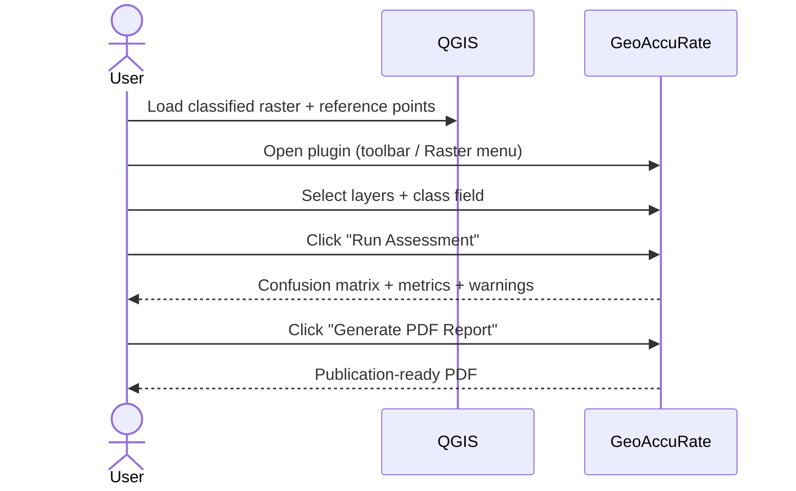
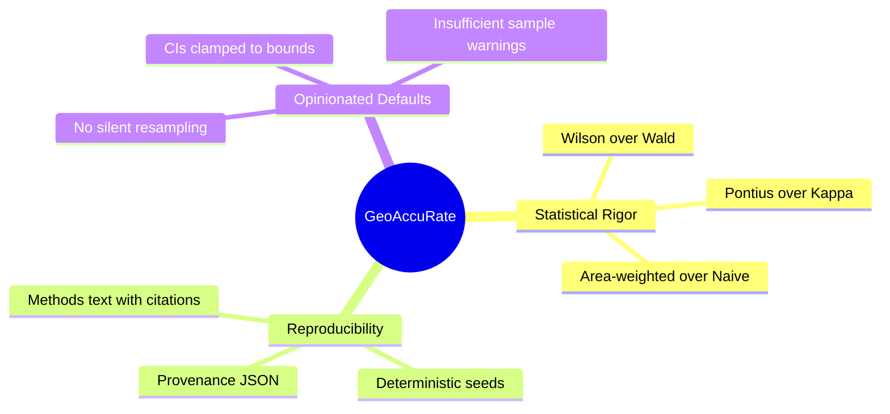
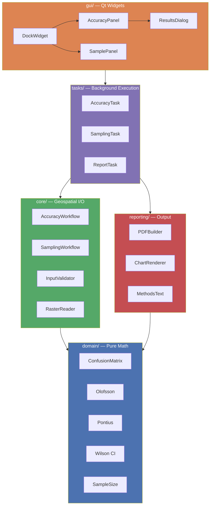
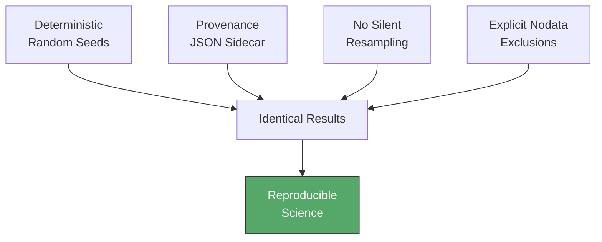
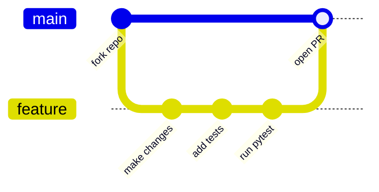

<p align="center">
  
</p>

<h1 align="center">GeoAccuRate</h1>

<p align="center">
  <b>Scientific Accuracy Assessment Framework for QGIS</b><br>
  Confusion Matrix &bull; Wilson CI &bull; Pontius Disagreement &bull; Olofsson Area-Weighted Estimation
</p>

<p align="center">
  <a href="https://github.com/Osman-Geomatics93/GeoAccuRate/releases/latest"></a>
  <a href="https://github.com/Osman-Geomatics93/GeoAccuRate/actions"></a>
  
  
  
  
</p>

<p align="center">
  
  
  
  
  
  
</p>

---

## Table of Contents

- [Why Accuracy Assessment Matters](#why-accuracy-assessment-matters)
- [How It Works](#how-it-works)
- [Features](#features)
- [Mathematical Foundation](#mathematical-foundation)
- [Comparison With Other Tools](#comparison-with-other-tools)
- [Screenshots](#screenshots)
- [Installation](#installation)
- [Quick Start](#quick-start)
- [Validation Philosophy](#validation-philosophy)
- [Design Philosophy](#design-philosophy)
- [Technical Highlights](#technical-highlights)
- [Who Should Use GeoAccuRate?](#who-should-use-geoaccurate)
- [Architecture](#architecture)
- [Testing](#testing)
- [Reproducibility & Scientific Integrity](#reproducibility--scientific-integrity)
- [Roadmap](#roadmap)
- [Known Limitations](#known-limitations)
- [FAQ](#faq)
- [References](#references)
- [Citation](#citation)
- [Contributing](#contributing)
- [Acknowledgements](#acknowledgements)
- [Contributors](#contributors)
- [Star History](#star-history)
- [Versioning](#versioning)
- [Vision](#vision)
- [License](#license)

---

## Why Accuracy Assessment Matters

Most GIS workflows stop at Overall Accuracy and Kappa. However, modern remote sensing research requires:

- Proper **confidence intervals** (not Wald approximations)
- **Disagreement decomposition** into Quantity and Allocation components (Pontius & Millones, 2011)
- **Area-weighted estimation** that corrects for sampling bias (Olofsson et al., 2014)
- **ISO 19157** quality reporting for standards compliance

GeoAccuRate brings these best practices directly into QGIS — no spreadsheets, no scripts, no guesswork.

<p align="right"><a href="#table-of-contents">Back to top</a></p>

## How It Works



GeoAccuRate replaces ad-hoc spreadsheet-based accuracy assessment with a single, reproducible workflow inside QGIS:

**Sample Design** &rarr; **Confusion Matrix** &rarr; **Publication-Ready Report**

<p align="right"><a href="#table-of-contents">Back to top</a></p>

## Features

- **Stratified random sampling** with sample size calculator, proportional/equal allocation, and minimum distance constraints
- **Confusion matrix** (counts and row-normalized %) for any number of classes
- **OA, PA, UA, F1** with **Wilson confidence intervals** (clamped to logical bounds)
- **Pontius metrics** (Quantity + Allocation Disagreement) — preferred over Kappa
- **Olofsson area-weighted estimation** with class area confidence intervals
- **PDF reports** with tables, heatmaps, interpretation notes, ISO 19157 mapping, auto-generated methods text, and proper citations
- **Persistent validation warnings** for small sample sizes and under-sampled classes
- **Opinionated defaults** — scientifically defensible out of the box

<p align="right"><a href="#table-of-contents">Back to top</a></p>

## Mathematical Foundation

GeoAccuRate implements peer-reviewed statistical methods. Here are the key equations:

### Sample Size (Cochran 1977)

$$n = \frac{z^2 \cdot p(1-p)}{E^2}$$

Where $z$ is the critical value, $p$ is expected accuracy, and $E$ is margin of error. With finite population correction:

$$n_{adj} = \frac{n}{1 + \frac{n}{N}}$$

### Wilson Confidence Interval

$$\widetilde{p} = \frac{1}{1 + \frac{z^2}{n}} \left( \hat{p} + \frac{z^2}{2n} \pm z \sqrt{\frac{\hat{p}(1-\hat{p})}{n} + \frac{z^2}{4n^2}} \right)$$

Unlike the Wald interval ($\hat{p} \pm z\sqrt{\frac{\hat{p}(1-\hat{p})}{n}}$), Wilson intervals never exceed $[0, 1]$ and perform well for extreme proportions and small samples.

### Pontius Disagreement Decomposition

$$\text{Quantity Disagreement} = \sum_{i=1}^{k} \left| p_{i+} - p_{+i} \right| \cdot \frac{1}{2}$$

$$\text{Allocation Disagreement} = 2 \sum_{i=1}^{k} \min(p_{i+} - p_{ii},\; p_{+i} - p_{ii})  \cdot \frac{1}{2}$$

Where $p_{i+}$ and $p_{+i}$ are row and column marginal proportions. These replace Kappa (Pontius & Millones, 2011).

### Olofsson Area-Weighted Estimation

$$\hat{A}_j = A_{\text{total}} \sum_{i=1}^{k} W_i \cdot \frac{n_{ij}}{n_{i\cdot}}$$

$$\text{SE}(\hat{A}_j) = A_{\text{total}} \sqrt{\sum_{i=1}^{k} W_i^2 \cdot \frac{\hat{p}_{ij}(1-\hat{p}_{ij})}{n_{i\cdot} - 1}}$$

Where $W_i = \frac{A_i}{A_{\text{total}}}$ are class area weights (Olofsson et al., 2014).

<details>
<summary><b>Why Wilson over Wald?</b></summary>
<br>

The Wald interval is the standard $\hat{p} \pm z \cdot \text{SE}$ formula taught in most textbooks. It has well-known problems:

| Issue | Wald | Wilson |
|-------|------|--------|
| CI can go below 0% or above 100% | Yes | No |
| Collapses to zero width at $p=0$ or $p=1$ | Yes | No |
| Poor coverage for small $n$ | Yes | No |
| Symmetric around $\hat{p}$ | Always | Only when appropriate |

GeoAccuRate uses Wilson intervals exclusively and clamps all CIs to logical bounds.

</details>

<details>
<summary><b>Why Pontius over Kappa?</b></summary>
<br>

Kappa has been criticized for:
- Being difficult to interpret (no intuitive meaning)
- Comparing to a "random" baseline that is itself debatable
- Conflating two distinct types of error

Pontius & Millones (2011) decompose total disagreement into:
- **Quantity Disagreement** — wrong amount of each class
- **Allocation Disagreement** — right amounts but wrong spatial placement

This decomposition is actionable: if QD is high, your classifier is biased; if AD is high, your classifier is spatially confused.

</details>

<p align="right"><a href="#table-of-contents">Back to top</a></p>

## Comparison With Other Tools

| Feature | GeoAccuRate | Default QGIS | ENVI | Google Earth Engine |
|---------|:-----------:|:------------:|:----:|:-------------------:|
| Wilson confidence intervals | :white_check_mark: | :x: | :x: | :x: |
| Pontius QD/AD decomposition | :white_check_mark: | :x: | :x: | :x: |
| Olofsson area-weighted estimation | :white_check_mark: | :x: | :warning: Partial | :wrench: Manual |
| ISO 19157 quality mapping | :white_check_mark: | :x: | :x: | :x: |
| Auto-generated methods text | :white_check_mark: | :x: | :x: | :x: |
| Publication-ready PDF report | :white_check_mark: | :x: | :x: | :x: |
| Sample size optimization | :white_check_mark: | :x: | :x: | :x: |
| Interpretation warnings | :white_check_mark: | :x: | :x: | :x: |

<p align="right"><a href="#table-of-contents">Back to top</a></p>

## Screenshots

<p align="center">
  
  &nbsp;&nbsp;
  
</p>

> Screenshots coming soon. Run the plugin to see it in action!

<p align="right"><a href="#table-of-contents">Back to top</a></p>

## Installation

### From QGIS Plugin Repository (Recommended)

1. In QGIS: **Plugins** > **Manage and Install Plugins**
2. Search for **GeoAccuRate**
3. Click **Install Plugin**

### From ZIP

1. Download the latest release ZIP from [Releases](https://github.com/Osman-Geomatics93/GeoAccuRate/releases)
2. In QGIS: **Plugins** > **Manage and Install Plugins** > **Install from ZIP**
3. Enable GeoAccuRate in the plugin manager

### Dependencies

- **numpy** and **scipy** (bundled with QGIS)
- **matplotlib** (bundled with recent QGIS versions)
- **ReportLab** (for PDF reports): `pip install reportlab` in the QGIS Python console

<details>
<summary><b>Troubleshooting Installation</b></summary>
<br>

**ReportLab won't install?**
Open the QGIS Python Console (`Plugins > Python Console`) and run:
```python
import subprocess, sys
subprocess.check_call([sys.executable, '-m', 'pip', 'install', 'reportlab'])
```

**Plugin not showing up?**
- Ensure the ZIP extracts to a folder named `geoaccurate/` (not nested)
- Check **Plugins > Manage and Install Plugins > Installed** and enable it
- Restart QGIS after installation

**matplotlib import error?**
This can happen on minimal QGIS installations. Install via:
```python
import subprocess, sys
subprocess.check_call([sys.executable, '-m', 'pip', 'install', 'matplotlib'])
```

**CRS warning when computing areas?**
GeoAccuRate requires a projected CRS for accurate area calculations. Reproject your raster to a local projected CRS (e.g., UTM) before running the assessment.

</details>

<p align="right"><a href="#table-of-contents">Back to top</a></p>

## Quick Start



1. Load your classified raster and reference point layer into QGIS
2. Open GeoAccuRate (toolbar icon or Raster menu)
3. Go to the **Accuracy** tab
4. Select your classified raster, reference layer, and class field
5. Click **Run Assessment**
6. Click **Generate PDF Report**

<p align="right"><a href="#table-of-contents">Back to top</a></p>

## Validation Philosophy

Accuracy assessment is not a checkbox — it is a **statistical inference problem**.

GeoAccuRate treats map validation as:

| Aspect | Approach |
|--------|----------|
| **Estimation** | Area-weighted inference correcting for sampling bias |
| **Uncertainty** | Confidence intervals on every metric, not just point estimates |
| **Error decomposition** | Separating quantity errors from allocation errors |
| **Transparency** | ISO 19157 mapping, provenance tracking, explicit assumptions |

The goal is not just a number, but **defensible evidence** that a classification meets its intended purpose.

> *"A map without an accuracy assessment is just a picture."*
> — Adapted from Congalton & Green (2019)

<p align="right"><a href="#table-of-contents">Back to top</a></p>

## Design Philosophy

GeoAccuRate is built on three principles:



1. **Statistical rigor first** — Wilson intervals over Wald, Pontius over Kappa, area-weighted over naive
2. **Reproducibility by default** — provenance JSON saved with every report, deterministic random seeds
3. **Opinionated scientific defaults** — no silent resampling, CIs clamped to logical bounds, warnings for insufficient sample sizes

The plugin avoids common pitfalls in accuracy assessment by enforcing projected CRS for area calculations, flagging under-sampled classes, and generating methods text with proper citations ready for journal submission.

<p align="right"><a href="#table-of-contents">Back to top</a></p>

## Technical Highlights

| Highlight | Detail |
|-----------|--------|
| **Clean architecture** | Domain layer isolated from QGIS API — pure Python + NumPy |
| **4-layer separation** | GUI / Core / Domain / Reporting with strict dependency direction |
| **92% test coverage** | 86 unit tests on the statistical core |
| **Background execution** | Long-running tasks via `QgsTask` — UI never freezes |
| **Zero QGIS imports in math** | `domain/` is independently testable with plain `pytest` |
| **Multi-version CI** | Tested against QGIS LTR and Stable on every push |
| **Thread-safe charts** | Matplotlib `Agg` backend for headless rendering |
| **Provenance tracking** | Every report includes a JSON sidecar with full run metadata |

<p align="right"><a href="#table-of-contents">Back to top</a></p>

## Who Should Use GeoAccuRate?

| Audience | Use Case |
|----------|----------|
| MSc / PhD students | Land cover validation for thesis |
| Remote sensing researchers | Publishing accuracy assessments |
| Government agencies | National land cover / land use mapping |
| NGOs | Environmental monitoring & reporting |
| Urban planners | Land use change analysis |
| Agricultural analysts | Crop classification validation |

<p align="right"><a href="#table-of-contents">Back to top</a></p>

## Architecture



The `domain/` layer is independently testable with plain pytest — no QGIS required.

```
geoaccurate/
├── domain/     # Pure math (numpy only, zero QGIS imports)
├── core/       # Geospatial I/O, validation, workflow orchestration
├── gui/        # Qt widgets, dock panel, dialogs
├── tasks/      # QgsTask background execution
└── reporting/  # PDF generation, charts, methods text
```

<p align="right"><a href="#table-of-contents">Back to top</a></p>

## Testing

```bash
# Domain tests (fast, no QGIS needed)
pytest geoaccurate/test/ -k "not integration" -v

# Full tests (requires QGIS environment)
pytest geoaccurate/test/ -v

# With coverage report
pytest geoaccurate/test/ -k "not integration" --cov=geoaccurate/domain --cov-report=term-missing
```

86 unit tests covering confusion matrix, normalization, Pontius, Olofsson, Wilson CI, Kappa, sampling, and edge cases. 92% coverage on the statistical core.

<p align="right"><a href="#table-of-contents">Back to top</a></p>

## Reproducibility & Scientific Integrity

GeoAccuRate enforces reproducibility at every step:



| Guarantee | How |
|-----------|-----|
| **Deterministic sampling** | Random seeds stored and reported — same seed = same samples |
| **Full provenance** | Every PDF report has a JSON sidecar recording inputs, parameters, software version, and timestamp |
| **No silent resampling** | Raster values are read at native resolution — no hidden interpolation |
| **Explicit exclusions** | Nodata pixels are counted and reported, never silently dropped |
| **Bounded confidence intervals** | CIs clamped to $[0, 1]$ for proportions and $[0, \infty)$ for areas — no impossible values |
| **Transparent methods** | Auto-generated methods text with citations you can paste into your manuscript |

All results are reproducible given the same input data and parameters.

<p align="right"><a href="#table-of-contents">Back to top</a></p>

## Roadmap

| Status | Feature |
|:------:|---------|
| :construction: | Change detection accuracy module |
| :construction: | Continuous raster validation (RMSE, MAE, NSE) |
| :bulb: | Multi-classifier comparison dashboard |
| :bulb: | Batch processing mode for multiple classifications |
| :bulb: | Automated LaTeX/Word export of methods text |
| :bulb: | Zenodo DOI integration for each release |

:white_check_mark: = Done &nbsp; :construction: = Planned &nbsp; :bulb: = Under consideration

<p align="right"><a href="#table-of-contents">Back to top</a></p>

## Known Limitations

We believe transparency about limitations builds trust. Here are the current boundaries:

| Limitation | Context |
|------------|---------|
| Assumes **independent reference samples** | Spatial autocorrelation between nearby reference points is not modeled |
| **No change detection** validation yet | Multi-date confusion matrices are on the roadmap |
| Area-weighted estimation requires **projected CRS** | Geographic (lat/lon) coordinates produce meaningless area values |
| **Integer class values** only | Continuous raster validation (regression metrics) is planned |
| PDF reports require **ReportLab** | Not bundled with QGIS — requires one-time `pip install` |
| **Single raster** per assessment | Multi-classifier comparison is a planned feature |

<p align="right"><a href="#table-of-contents">Back to top</a></p>

## FAQ

<details>
<summary><b>Why does GeoAccuRate use Wilson intervals instead of the standard formula?</b></summary>
<br>

The "standard" Wald interval ($\hat{p} \pm 1.96\sqrt{\hat{p}(1-\hat{p})/n}$) can produce confidence intervals below 0% or above 100%, and has poor coverage for small samples or extreme proportions. The Wilson interval is bounded by construction and has better statistical properties. See Agresti & Coull (1998) for a thorough comparison.

</details>

<details>
<summary><b>Should I report Kappa or Pontius metrics?</b></summary>
<br>

Pontius metrics (Quantity Disagreement + Allocation Disagreement). Kappa has been widely criticized in the remote sensing literature — it compares to a "chance" baseline that is poorly defined, and it conflates two distinct types of mapping error. GeoAccuRate still computes Kappa for backward compatibility, but the PDF report explicitly recommends Pontius metrics following Pontius & Millones (2011).

</details>

<details>
<summary><b>What is the minimum recommended sample size?</b></summary>
<br>

GeoAccuRate warns when total samples are below 50 and when any individual class has fewer than 25 reference points (following Olofsson et al., 2014). Use the built-in sample size calculator to determine the optimal sample size for your desired confidence level and margin of error.

</details>

<details>
<summary><b>Can I use GeoAccuRate with rasters in geographic (lat/lon) CRS?</b></summary>
<br>

For the confusion matrix and per-class metrics: yes, CRS doesn't matter. For Olofsson area-weighted estimation: you need a projected CRS, because area calculations in degrees are meaningless. GeoAccuRate will warn you if your raster is in a geographic CRS when area estimation is requested.

</details>

<details>
<summary><b>What file formats are supported?</b></summary>
<br>

Any raster format QGIS can read (GeoTIFF, ERDAS IMG, JPEG2000, etc.) and any vector format for reference points (GeoPackage, Shapefile, GeoJSON, etc.). The classified raster must contain integer class values.

</details>

<details>
<summary><b>How do I cite GeoAccuRate in a journal paper?</b></summary>
<br>

See the [Citation](#citation) section below. GeoAccuRate also auto-generates a methods paragraph with proper citations that you can paste directly into your manuscript.

</details>

<p align="right"><a href="#table-of-contents">Back to top</a></p>

## References

- Agresti, A. and Coull, B.A. (1998). Approximate is better than "exact" for interval estimation of binomial proportions. *The American Statistician*, 52(2), 119-126. [doi:10.1080/00031305.1998.10480550](https://doi.org/10.1080/00031305.1998.10480550)
- Cochran, W.G. (1977). *Sampling Techniques*, 3rd ed. John Wiley & Sons.
- Congalton, R.G. and Green, K. (2019). *Assessing the Accuracy of Remotely Sensed Data*, 3rd ed. CRC Press.
- Olofsson, P. et al. (2014). Good practices for estimating area and assessing accuracy of land use change. *Remote Sensing of Environment*, 148, 42-57. [doi:10.1016/j.rse.2014.02.015](https://doi.org/10.1016/j.rse.2014.02.015)
- Pontius, R.G. Jr. and Millones, M. (2011). Death to Kappa. *International Journal of Remote Sensing*, 32(15), 4407-4429. [doi:10.1080/01431161.2011.552923](https://doi.org/10.1080/01431161.2011.552923)
- ISO (2013). ISO 19157:2013 Geographic information — Data quality. International Organization for Standardization.

<p align="right"><a href="#table-of-contents">Back to top</a></p>

## Citation

If you use GeoAccuRate in academic work, please cite:

> Ibrahim, O. (2026). GeoAccuRate: A unified accuracy assessment framework for QGIS. Version 1.1.1. https://github.com/Osman-Geomatics93/GeoAccuRate

### BibTeX

```bibtex
@software{ibrahim2026geoaccurate,
  author    = {Ibrahim, Osman},
  title     = {GeoAccuRate: A Unified Accuracy Assessment Framework for QGIS},
  year      = {2026},
  version   = {1.1.1},
  url       = {https://github.com/Osman-Geomatics93/GeoAccuRate},
  license   = {GPL-2.0-or-later}
}
```

<p align="right"><a href="#table-of-contents">Back to top</a></p>

## Contributing

Contributions are welcome! Here's how to get started:



1. Fork the repository
2. Create a feature branch (`git checkout -b feature/my-improvement`)
3. Make your changes and add tests
4. Ensure tests pass: `pytest geoaccurate/test/ -k "not integration" -v`
5. Open a [Pull Request](https://github.com/Osman-Geomatics93/GeoAccuRate/pulls)

You can also:
- Open an [issue](https://github.com/Osman-Geomatics93/GeoAccuRate/issues) for bug reports or feature requests
- Help improve documentation or translations

<p align="right"><a href="#table-of-contents">Back to top</a></p>

## Acknowledgements

GeoAccuRate stands on the shoulders of foundational work in accuracy assessment:

- **Pontius, R.G. Jr.** and **Millones, M.** — for the Quantity/Allocation Disagreement framework that replaces Kappa
- **Olofsson, P.**, **Foody, G.M.**, **Herold, M.**, **Stehman, S.V.**, **Woodcock, C.E.**, and **Wulder, M.A.** — for the definitive good practices guide on area estimation and accuracy assessment
- **Congalton, R.G.** and **Green, K.** — for the foundational textbook on remote sensing accuracy assessment
- **Cochran, W.G.** — for the sampling theory underlying the sample size calculator
- **Wilson, E.B.** — for the confidence interval method that bears his name

Built with the amazing open-source ecosystem: [QGIS](https://qgis.org), [NumPy](https://numpy.org), [SciPy](https://scipy.org), [Matplotlib](https://matplotlib.org), [ReportLab](https://www.reportlab.com), and [Qt](https://www.qt.io).

<p align="right"><a href="#table-of-contents">Back to top</a></p>

## Contributors

<a href="https://github.com/Osman-Geomatics93/GeoAccuRate/graphs/contributors">
  
</a>

<p align="right"><a href="#table-of-contents">Back to top</a></p>

## Star History

<a href="https://star-history.com/#Osman-Geomatics93/GeoAccuRate&Date">
  <picture>
    <source media="(prefers-color-scheme: dark)" srcset="https://api.star-history.com/svg?repos=Osman-Geomatics93/GeoAccuRate&type=Date&theme=dark" />
    <source media="(prefers-color-scheme: light)" srcset="https://api.star-history.com/svg?repos=Osman-Geomatics93/GeoAccuRate&type=Date" />
    
  </picture>
</a>

<p align="right"><a href="#table-of-contents">Back to top</a></p>

## Versioning

GeoAccuRate follows [Semantic Versioning](https://semver.org/):

| Increment | Meaning | Example |
|-----------|---------|---------|
| **MAJOR** | Breaking API or workflow changes | 2.0.0 |
| **MINOR** | New statistical modules or features | 1.2.0 |
| **PATCH** | Bug fixes, documentation, CI improvements | 1.1.1 |

See the [CHANGELOG](CHANGELOG.md) for a full release history.

<p align="right"><a href="#table-of-contents">Back to top</a></p>

## Vision

GeoAccuRate aims to become the **standard open-source framework** for scientifically defensible accuracy assessment in QGIS.

We believe that:
- Every classified map deserves a proper accuracy assessment
- Statistical rigor should be accessible, not locked behind proprietary software
- Reproducibility is a requirement, not a luxury
- The gap between research best practices and practitioner tools should not exist

If you believe map validation deserves better tools — **join the effort**.

<p align="right"><a href="#table-of-contents">Back to top</a></p>

## License

GPLv2+ — see [LICENSE](geoaccurate/LICENSE) for details.

---

<p align="center">
  Made with :heart: for the remote sensing community
</p>
